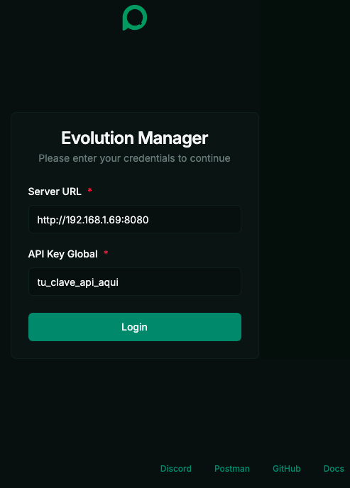

# 🐧 Evolution API Dockerizado para VPS Linux

Este proyecto está basado en el repositorio oficial de [Evolution API](https://github.com/EvolutionAPI/evolution-api), una solución para enviar mensajes de WhatsApp a través de una API sencilla y potente.

Este entorno incluye:

- Evolution API
- Redis
- PostgreSQL
- Variables de entorno configurables
- Documentación clara para exponer puertos y asegurar el servicio

> Ideal para los que deseen tener la Evolution API funcionando en un VPS minutos, sin configuraciones complicadas ni instalaciones manuales.

---

## ✅ Requisitos

Asegúrate de tener instalados:

```bash
docker -v
docker compose version
```

Si no los tienes, puedes instalarlos con:

- [Docker Engine](https://docs.docker.com/engine/install/)
- [Docker Compose Plugin](https://docs.docker.com/compose/install/)

También se recomienda agregar tu usuario al grupo `docker` para evitar usar `sudo`:

- [Post-installation steps for Linux] (https://docs.docker.com/engine/install/linux-postinstall/)

## 🚀 Instalación del proyecto

### 1. Clona este repositorio

```bash
git clone https://github.com/devalexcode/docker-evolution-api.git
cd docker-evolution-api
```

### 2. Crea el archivo `.env`

```bash
cp .env.example .env
```

## ⚙️ Configuración del archivo `.env`

Antes de levantar los servicios, asegúrate de crear y configurar tu archivo `.env`:

```bash
# Abre el editor de código para editar los valores por defecto
nano .env
```

Edita el archivo `.env` con tus propios valores:

```dotenv
# 🔐 EVOLUTION API
AUTHENTICATION_API_KEY=tu_clave_api_aqui           # Clave de autenticación para la API de Evolution
EVOLUTION_API_PORT=8080                            # Puerto donde se expondrá la API (si tienes otra aplicación corriendo por este puerto cambia este valor)

# 🧠 REDIS
REDIS_PORT=6379                                     # Puerto por defecto de Redis

# 🐘 POSTGRESQL
POSTGRESS_PORT=5432                                 # Puerto por defecto de PostgreSQL
POSTGRESS_USER=usuario_postgres                     # Usuario de la base de datos (POR SEGURIDAD MODIFICA ESTE VALOR)
POSTGRESS_PASS=clave_segura                         # Contraseña del usuario (POR SEGURIDAD MODIFICA ESTE VALOR)
```

### 3. Levanta los servicios

```bash
docker compose up -d
```

Este comando:

- Construye las imágenes necesarias
- Levanta los contenedores definidos en `docker-compose.yml`
- Todo en segundo plano (`-d`)

---

## 📦 Verifica que el contenedor esté en ejecución

Después de levantar el entorno con `docker compose up -d`, puedes verificar que Evolution API se esté ejecutando correctamente con:

```bash
docker ps
```

Deberías ver una salida similar a esta:

```bash
CONTAINER ID   IMAGE                            COMMAND                  CREATED          STATUS              PORTS                                                                                   NAMES
e3b6d8e6c317   atendai/evolution-api:latest     "/bin/bash -c '. ./D…"   28 seconds ago   Up 26 seconds       0.0.0.0:8080->8080/tcp, [::]:8080->8080/tcp                                            evolution_api
```

---

## 🌐 Acceso a la aplicación

Accede desde el navegador (o usa `curl`) en:

```
http://IP_DEL_SERVIDOR:8080/manager
```



> Ingresa en el campo API Key Global el valor que asignaste en el archivo .env  
> Reemplaza `8080` con el puerto configurado si usaste otro.  
> Si estás en localhost, puedes usar `http://localhost:8080/manager`

---

## 🔐 Exponer el puerto de Evolution API (opcional)

Si estás en un servidor Linux con `ufw` (firewall) activado, puedes exponer únicamente el puerto necesario para acceder a la Evolution API desde el exterior.

### ✅ Permitir solo el puerto definido en `.env` (por ejemplo, 8080)

```bash
sudo ufw allow 8080
```

> Asegúrate de que el valor de `EVOLUTION_API_PORT` en tu `.env` coincida con el puerto que estás abriendo.

### 🔍 Verifica que el puerto está permitido

```bash
sudo ufw status
```

Deberías ver una regla como:

```
8080                       ALLOW       Anywhere
```

> ⚠️ No abras puertos que no necesites desde el exterior. Si solo vas a consumir la API localmente (dentro del mismo contenedor o red Docker), **no necesitas abrir el puerto con UFW**.

---

## 👨‍💻 Autor

Desarrollado por [Alejandro Robles | Devalex ](http://devalexcode.com)  
¿Necesitas que lo haga por ti? ¡Estoy para apoyarte! 🤝 http://devalexcode.com/soluciones/evolution-api-whatsapp-en-servidor-vps

¿Dudas o sugerencias? ¡Contribuciones bienvenidas!
